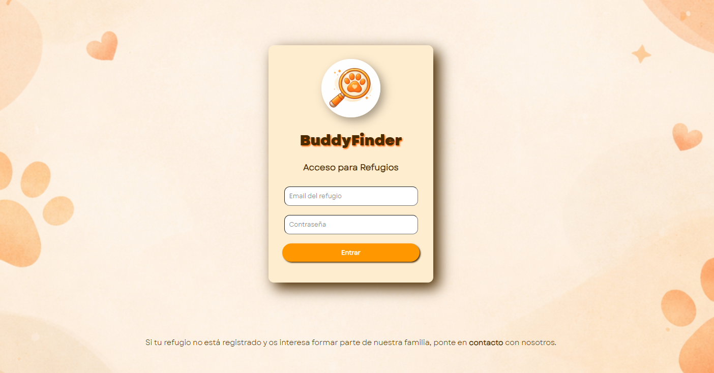
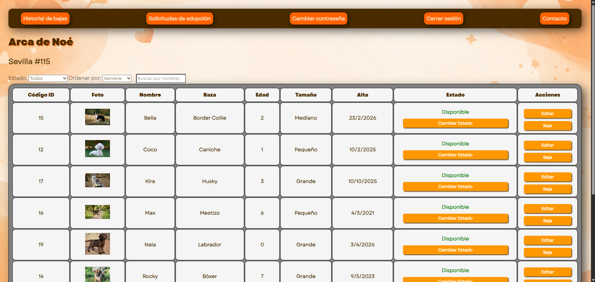
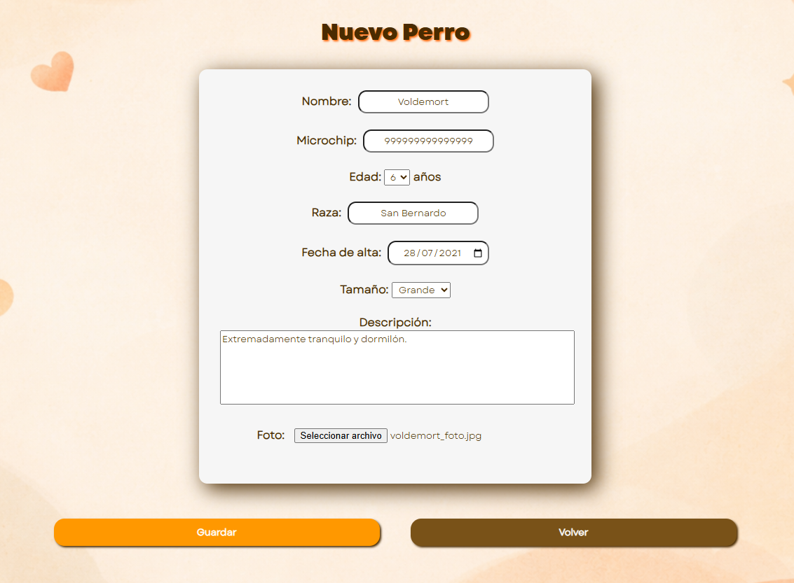
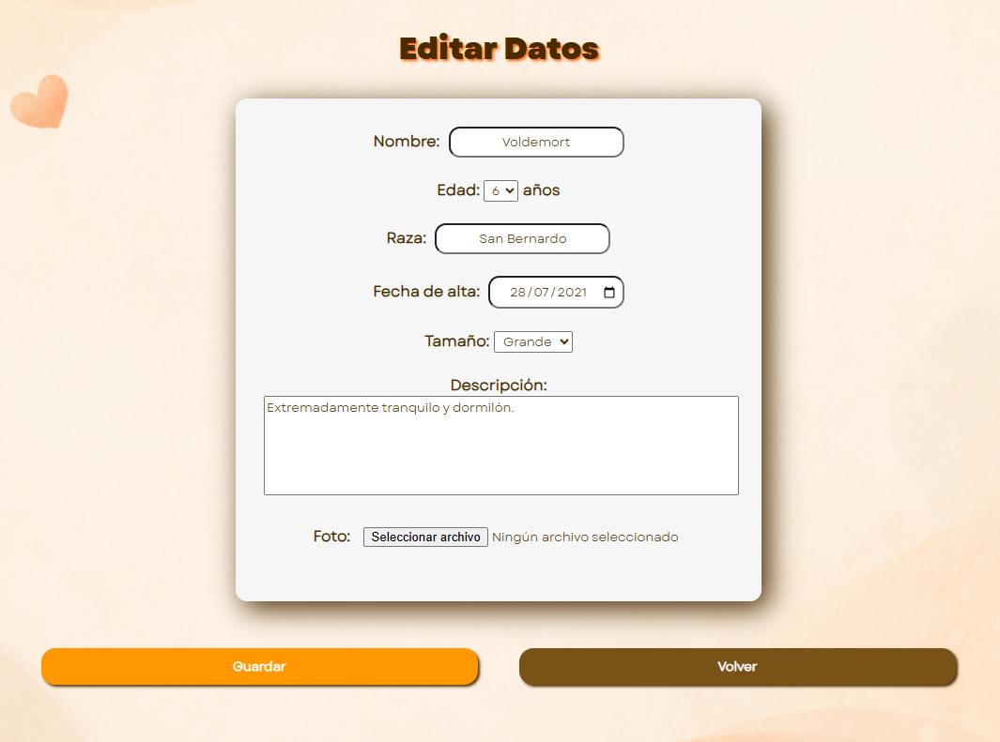
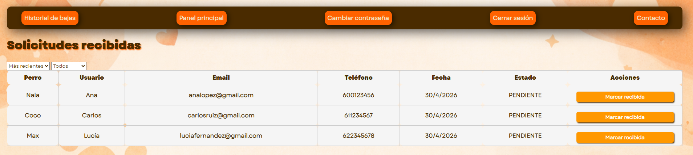
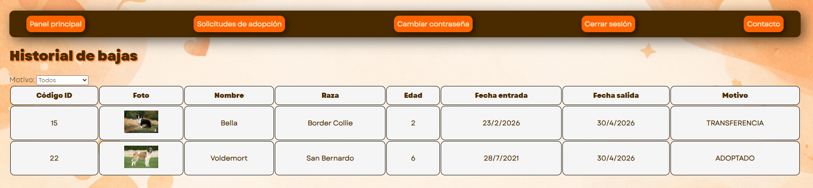

# BuddyFinder - Panel Web de Refugios

> Módulo web del TFG BuddyFinder · HTML · CSS · JavaScript

Panel de gestión para **refugios de animales**. Permite a cada refugio administrar su catálogo de perros en adopción, gestionar el estado de los animales y atender las solicitudes de adopción recibidas desde la app móvil.

**Repositorio de la API (núcleo del sistema):** [TFG_BuddyFinderAPI](https://github.com/Andy-McFly/TFG_BuddyFinderAPI)

---

## Capturas de pantalla

| Login | Panel principal |
|-------|----------------|
|  |  |

| Alta de perro | Editar perro |
|--------------|-------------|
|  |  |

| Solicitudes recibidas | Historial de bajas |
|----------------------|-------------------|
|  |  |

---

## Funcionalidades

- **Login con credenciales** del refugio (autenticado contra la API)
- **Cambio de contraseña** desde el perfil
- **Panel principal**: tabla completa de los perros del refugio con foto, nombre, raza, edad, tamaño, fecha de alta y estado. Búsqueda por nombre, filtro por estado y ordenación
- **Alta de perro**: formulario con subida de foto y todos los datos del animal
- **Edición de perro**: modificación de cualquier campo directamente desde el panel
- **Cambio de estado**: marcar un perro como "Disponible", "No disponible" o gestionar su baja del refugio
- **Solicitudes de adopción**: listado de solicitudes recibidas con datos de contacto del usuario, fecha y estado de la solicitud. Acciones para actualizar sus estados
- **Historial de bajas**: registro de todos los perros que han salido del refugio (adoptados o transferidos)

---

## Funcionamiento interno

El panel web se comunica directamente con la API REST mediante `fetch()`. Cada acción del usuario genera una petición HTTP al endpoint correspondiente.

La autenticación se gestiona almacenando el ID del refugio en `sessionStorage` tras el login, que se incluye en cada petición posterior para obtener solo los datos del refugio autenticado.

---

## Tecnologías

| Tecnología | Uso |
|-----------|-----|
| **HTML5** | Estructura de las páginas |
| **CSS3** | Estilos y diseño responsive |
| **JavaScript (vanilla)** | Lógica, llamadas a la API y manipulación del DOM |
| **Fetch API** | Comunicación asíncrona con la API REST |
| **Fuente personalizada** | Identidad visual coherente con el resto del sistema |

---

## Aprendizajes clave

- Consumo de una **API REST propia** desde el navegador web
- **Manipulación dinámica del DOM** sin frameworks: generación de tablas, formularios y mensajes desde JavaScript
- Gestión básica de **sesión en cliente** con `sessionStorage`
- Diseño de una interfaz funcional y coherente en **HTML/CSS puro**
- Coordinación de múltiples vistas que comparten estado y datos de la misma API

---

*Proyecto Final de Ciclo · CFGS DAM · Grupo Studium Formación, Sevilla · 2026*
